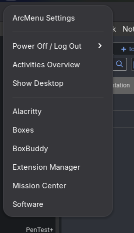

# Setup Checklist

- Run updates
- Add in Flathub `flatpak remote-add --if-not-exists flathub https://dl.flathub.org/repo/flathub.flatpakrepo`
- Setup RPM Fusion
    - In Software, remove any of the Fusion repo's if they are not needed.
    - Run the most recent commands off their web site to add the repository in. As of 5/1, its `sudo dnf install https://mirrors.rpmfusion.org/free/fedora/rpmfusion-free-release-$(rpm -E %fedora).noarch.rpm https://mirrors.rpmfusion.org/nonfree/fedora/rpmfusion-nonfree-release-$(rpm -E %fedora).noarch.rpm`
    - Install the missing codecs using `sudo dnf install libavcodec-freeworld`
- Software Needed to Manage the System
    - [Extention Manager](https://flathub.org/apps/com.mattjakeman.ExtensionManager)
        - Used to install all the following extensions **Except AppIndicator and KStatusNotifierItem support**
    - [Refine](https://flathub.org/apps/page.tesk.Refine)
        - Use Refine to give yourself back the Minimize and Maximize Buttons
    - [Ignition](https://flathub.org/apps/io.github.flattool.Ignition)
- The Essential Extensions
    - AppIndicator and KStatusNotifierItem Support
        - **As of 5/1, can only be installed from Fedora's repo. Fedora and Ubuntu maintain their own patch.**
        - `sudo dnf install gnome-shell-extension-appindicator.noarch`
    - Arc Menu
        - Using Brisk as the menu
        - Setup with a context menu and enable launching its StandAlone Runner Menu with Alt+Space
        - 
    - Blur my shell
    - Caffeine
    - Dash to Dock
    - Space Bar
- Add Script to be able to toggle touchpad on and off
    - Code  
        
        ```Bash
        #!/bin/bash
        
        # Get the current state of the touchpad
        touchpad_state=$(gsettings get org.gnome.desktop.peripherals.touchpad send-events)
        
        # Function to enable the touchpad
        enable_touchpad() {
          gsettings set org.gnome.desktop.peripherals.touchpad send-events 'enabled'
          notify-send "Touchpad enabled."
        }
        
        # Function to disable the touchpad
        disable_touchpad() {
          gsettings set org.gnome.desktop.peripherals.touchpad send-events 'disabled'
          notify-send "Touchpad disabled."
        }
        
        # Toggle touchpad state based on current status
        if [[ "$touchpad_state" == "'enabled'" ]]; then
          disable_touchpad
        else
          enable_touchpad
        fi
        ```
        
    - Bind this to a keyboard shortcut in Settings -> Keyboard.  I use Super+Shift+P
 - Settings To Adjust
	 - Turn off hot corner
	 - Set touchpad for corner push and side scrolling
